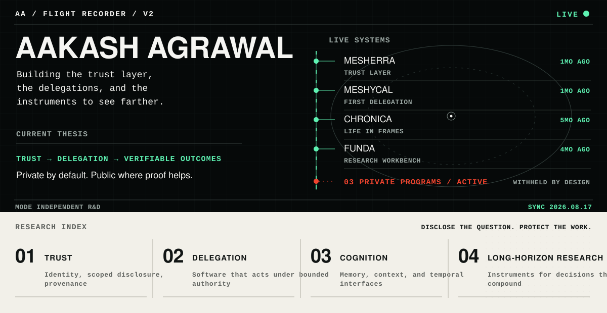
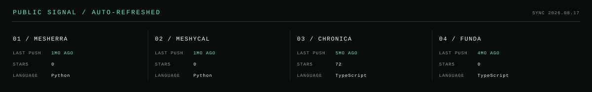
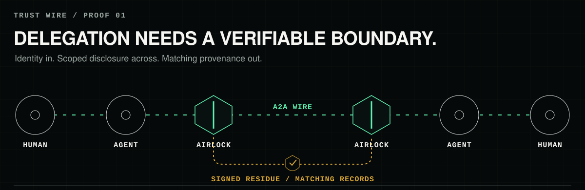

<div align="center">
  <picture>
    <source media="(max-width: 640px)" srcset="./assets/flight-recorder-mobile.svg" />
    
  </picture>
</div>

<p align="center">
  <a href="https://www.aakashagrawal.me">FIELD NOTES</a>
  &nbsp;&nbsp;·&nbsp;&nbsp;
  <a href="https://github.com/Aakash-a18?tab=repositories">PUBLIC ARCHIVE</a>
  &nbsp;&nbsp;·&nbsp;&nbsp;
  <a href="#public-proofs">ACTIVE PROOFS</a>
</p>

I build systems for **delegated software**: trust layers, bounded authority, temporal interfaces, and research instruments for decisions that compound.

## Public proofs

### `01` [Mesherra](https://github.com/Aakash-a18/mesherra) · `PRE-ALPHA / ACTIVE`

Identity verification, scoped disclosure, and signed provenance for agent-to-agent interaction.

### `02` [MeshyCal](https://github.com/Aakash-a18/meshycal) · `FIRST DELEGATION`

Two agents negotiate a meeting without exposing either calendar, then attest the result.

### `03` [Chronica](https://github.com/Aakash-a18/chronica-life-in-frames) · `PUBLIC / SHIPPED`

An Obsidian life calendar that turns decades into a navigable grid of weeks.

### `04` [Funda](https://github.com/Aakash-a18/funda) · `PUBLIC / EXPLORING`

A personal investment research workbench for structured, long-horizon inquiry.

<div align="center">
  <picture>
    <source media="(max-width: 640px)" srcset="./assets/public-signal-mobile.svg" />
    
  </picture>
</div>

## Trust wire

The next software does not wait to be opened. It acts under delegated authority. That makes identity, scoped disclosure, and matching provenance part of the product—not security notes added later.

<div align="center">
  <a href="https://github.com/Aakash-a18/mesherra">
    <picture>
      <source media="(max-width: 640px)" srcset="./assets/agentic-handshake-mobile.svg" />
      
    </picture>
  </a>
</div>

## Private work, publicly legible

Most active programs remain private while their questions are unstable. The boundary is deliberate:

- **Questions** are shared when they make the work more legible.
- **Proofs** are linked when there is something concrete to inspect.
- **Repository identity and implementation** remain private until intentionally disclosed.

## Operating constraints

```text
PROOF BEFORE PROCLAMATION.
DEFAULT TO WITHHOLDING.
BUILD THE SMALLEST HONEST TEST RIG.
ABSTRACT ONLY AFTER THE SECOND REAL USE.
PUBLISH WHEN THE WORK CAN WITHSTAND BEING SEEN.
```

<p align="center"><sub>Generated from a public-safe manifest. The automation queries only explicitly listed public repositories.</sub></p>
